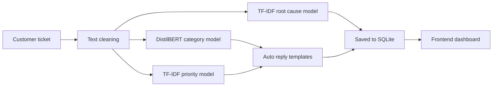

# SmartDesk

<p align="center">
  <strong>AI-powered customer support ticket routing, prioritization, and reply drafting.</strong><br/>
  DistilBERT for category classification, TF-IDF + Logistic Regression for priority and root cause, with a feedback loop that improves lightweight models over time.
</p>

<p align="center">
  
  
  
  
  
</p>

## Overview

SmartDesk helps support teams analyze incoming tickets in seconds. A user pastes a message or uploads a CSV, and the system returns:

- issue category
- urgency priority
- root cause
- confidence scores
- a suggested support reply

The project is designed as a practical hybrid NLP system:

- DistilBERT handles semantic category classification.
- TF-IDF + Logistic Regression handle priority and root cause detection.
- A rule-based reply layer generates consistent, safe support responses.
- Feedback can be stored and used to retrain the lightweight models.

## Demo Flow



## Key Features

- Single-ticket analysis with confidence scores.
- Bulk CSV analysis with batched inference.
- History and dashboard views for reviewed tickets.
- Feedback capture for human corrections.
- Optional retraining for priority and root-cause models.
- Generated reply endpoint with safe fallback behavior.

## Tech Stack

### Backend

- Flask
- Flask-CORS
- Transformers
- PyTorch
- scikit-learn
- joblib
- SQLite

### Frontend

- React 19
- React Router
- Axios
- Framer Motion
- React Hot Toast
- Recharts
- Tailwind CSS

## Repository Layout

```text
backend/
  app.py               Flask API with inference endpoints
  database.py          SQLite helpers
  generative.py        Optional reply generation
  active_learning.py    Retraining from feedback
  models/               Saved model artifacts
frontend/
  src/                  React app, pages, and components
  public/               Static assets
docker-compose.yml      Backend container setup
Dockerfile              Backend image build
```

## Getting Started

### Prerequisites

- Python 3.12+
- Node.js 18+
- npm

### 1. Start the backend

```bash
cd backend
pip install -r requirements.txt
python app.py
```

The API runs on `http://localhost:5000`.

### 2. Start the frontend

```bash
cd frontend
npm install
npm start
```

The app runs on `http://localhost:3000`.

### 3. Optional Docker run

```bash
docker build -t smartdesk .
docker run -p 5000:5000 smartdesk
```

Or use Docker Compose:

```bash
docker compose up --build
```

## API Endpoints

| Method | Endpoint | Purpose |
| --- | --- | --- |
| GET | `/health` | Health check and model status |
| POST | `/analyze` | Analyze one support ticket |
| POST | `/analyze/bulk` | Analyze a CSV upload |
| GET | `/stats` | Dashboard statistics |
| POST | `/feedback` | Save agent corrections |
| POST | `/generate` | Generate a support reply |
| POST | `/feedback/retrain` | Retrain lightweight models from feedback |

## How It Works

1. User submits a ticket from the React UI.
2. The backend cleans text by removing mentions, URLs, and extra whitespace.
3. DistilBERT predicts the category.
4. TF-IDF + Logistic Regression predict priority and root cause.
5. A template-based reply is returned.
6. Results are stored in SQLite for history and analytics.
7. Corrections can be collected and used for retraining.

## Models

- Category classification: DistilBERT sequence classifier.
- Priority detection: TF-IDF vectorizer + Logistic Regression.
- Root cause detection: TF-IDF vectorizer + Logistic Regression.
- Reply generation: template-based support replies with optional generation path.

## Data and Training

- Training data is based on the Twitter US Airline Sentiment dataset used as a support-ticket style corpus.
- Ticket text is cleaned before inference and training.
- The category model is pretrained and fine-tuned.
- The priority and root-cause models are trained from scratch on labeled examples.
- Feedback retraining updates the lightweight models without retraining DistilBERT.

## Frontend Pages

- Dashboard: analytics and quick stats.
- Analyze: single ticket analysis.
- Bulk Analyze: CSV upload and batch processing.
- Review: feedback and correction workflow.
- History: ticket history and audit trail.
- About: project summary and metrics.

## Notes

- The frontend uses `REACT_APP_API_URL` if you want to point it at a remote backend.
- The backend expects its model artifacts in `backend/models/`.
- SQLite is used for simplicity and demo-friendly local storage.

## License

No license file is currently included. Add one if you plan to publish or share the project publicly.
